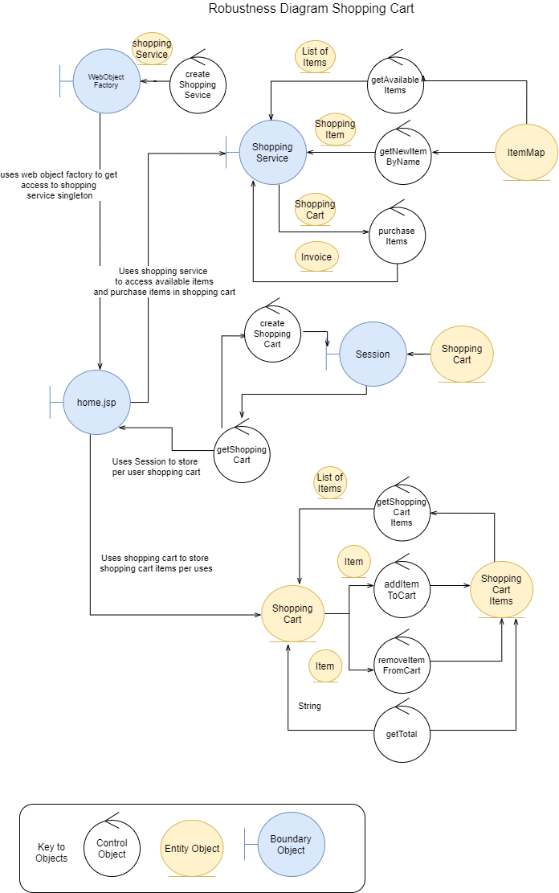

# System Diagrams
## Robustness Diagram

## Sequence Diagrams
Below are some sequence diagrams, detailing the sequence of how each page works with their controllers.

### Placing an Order

This diagram is rather large due to the steps involved in placing an order.

Not only is an order placed, but the item quantity is reduced from stock, the cart is cleared, an invoice of the order is created and the transaction with the bank takes place.

### Viewing Orders

This diagram contains a duplicated sequence. However this is due to the post parameters. getOrderByInvoiceNumber is called for when viewing an order and for when updating an order.

### Updating Payment Settings

This sequence is when updating the payment settings for the account to send the payment to.

### View Cart

In the cart there are options to increase, decrease or remove items.

### Catalog

The Catalog page allows admins to modify items and also update them. Due to the way JPA works, saving an item with the same ID will update the database, and so there doesn't need to be any complex update sql commands.

### View Checkout

The sequence diagram doesnt show any items in the viewcheckout method, however this is because the shopping cart is stored in the session.

### Shop

The shop view allows items to be added to the cart.

### View Product

Items can be added to cart from the product view, however the jsp posts the request to the shop page to achieve this.