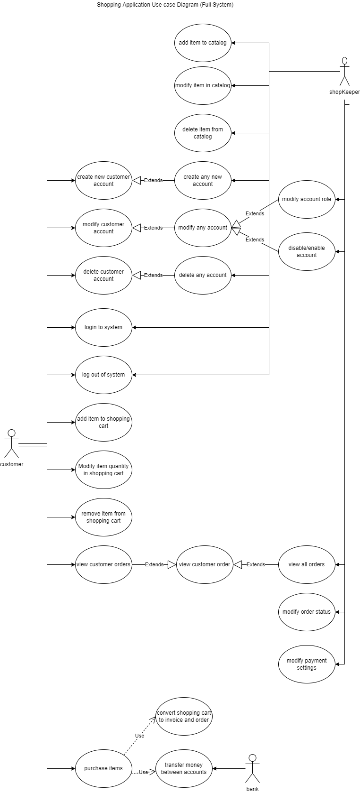

# Use Cases and Feature list

## Diagram

Below is the use case diagram for the shopping application.

## Feature list
1. Catalog
    1. Add item to catalog
    2. Modify item in catalog
        1. Enable/disable item
        2. Set item stock levels
        3. Change item image
        4. modify item details
    3. Delete item from catalog
2. Accounts
    1. Create Account
        1. Shop owner create any account
        2. Customer creates account
    2. Modify account
        1. Shop owner enable/disable accounts
        2. Shop owner modify account role
        3. Customer modify account details
    3. Delete account
    4. Login to account
    5. Log out of account
3. Shopping Cart
    1. Add item to cart
    2. Modify item quanitity in cart
    3. Remove item from cart
4. Orders
    1. View order
    2. View all orders
        1. Customer views all their orders
        2. Shop owner views all orders
    3. Modify order status
5. Modify payment settings
6. Purchase items

## Use Cases
### Catalog

|                        |      |
| :---                   | :--- |
| **Feature No.**        | 1.1
| **Feature Name**       | Add item to catalog
| **Description:**       | items should be able to be added to the catalog   
| **Actors:**            | Shop Owner
| **Preconditions:**     | Shop Owner (admin) logged in
| **Postconditions:**    | New item added to catalog
| **Flow:**              | Shop Owner navigates to "Manage catalog" page.   Clicks on "New item" button.  Fills in item details.  Clicks "save".

|                        |      |
| :---                   | :--- |
| **Feature No.**        | 1.2.1
| **Feature Name**       | Enable/Disable item
| **Description:**       | items should be able to be enabled and disabled so they do not show up in the shop  
| **Actors:**            | Shop Owner
| **Preconditions:**     | Shop Owner (admin) logged in
| **Postconditions:**    | Item Enabled/Disabled
| **Flow:**              | Shop Owner navigates to "Manage catalog" page.   Clicks on "Edit item" button on the item they want to enable/disable.  Ticks the box to Enable/Disable item.  Clicks "save".

|                        |      |
| :---                   | :--- |
| **Feature No.**        | 1.2.2
| **Feature Name**       | Set item stock levels
| **Description:**       | item stock levels should be able to be modified 
| **Actors:**            | Shop Owner
| **Preconditions:**     | Shop Owner (admin) logged in
| **Postconditions:**    | Item stock levels updated
| **Flow:**              | Shop Owner navigates to "Manage catalog" page.   Clicks on "Edit item" button on the item they want to change the stock levels.  Enters quantity in the quantity field on the form.  Clicks "save".

|                        |      |
| :---                   | :--- |
| **Feature No.**        | 1.2.3
| **Feature Name**       | Change item image
| **Description:**       | item images should be changeable
| **Actors:**            | Shop Owner
| **Preconditions:**     | Shop Owner (admin) logged in
| **Postconditions:**    | Item image updated
| **Flow:**              | Shop Owner navigates to "Manage catalog" page.   Clicks on "Edit item" button on the item they want to change the image.  clicks button to choose file under the image section of the form.  inspects preview is correct.   Clicks "upload".

|                        |      |
| :---                   | :--- |
| **Feature No.**        | 1.2.4
| **Feature Name**       | Modify item details
| **Description:**       | item details should be changeable
| **Actors:**            | Shop Owner
| **Preconditions:**     | Shop Owner (admin) logged in
| **Postconditions:**    | Item details updated
| **Flow:**              | Shop Owner navigates to "Manage catalog" page.   Clicks on "Edit item" button on the item they want to modify.  inputs different details for name/description/price.  Clicks "save".

|                        |      |
| :---                   | :--- |
| **Feature No.**        | 1.3
| **Feature Name**       | Delete item from catalog
| **Description:**       | items should be able to be deleted
| **Actors:**            | Shop Owner
| **Preconditions:**     | Shop Owner (admin) logged in
| **Postconditions:**    | Item deleted
| **Flow:**              | Shop Owner navigates to "Manage catalog" page.   Clicks on "delete item" button on the item they want to delete.

### Owner Login
|                        |      |
| :---                   | :--- |
| **Description:**       | Shop Owner Login to system    
| **Actors:**            | Shop Owner
| **Preconditions:**     | System not logged in
| **Postconditions:**    | System logged in
| **Flow:**              | Shop Owner logs in using known code
| **Alternative Flows:** | Error message if wrong code used
| **Exceptions:**        | not required if machine already logged in
| **Requirements:**      | If first time login ask shop owner to setup bank details/card for payments to go to
### Accepted transaction
|                        |      |
| :---                   | :--- |
| **Description:**       | Purchasing goods accepted     
| **Actors:**            | Shop Owner & Customer
| **Preconditions:**     | Customer wants to buy goods
| **Postconditions:**    | Customer has bought goods
| **Flow:**              | Shop owner enters details - accepted from bank 
| **Alternative Flows:** | 
| **Exceptions:**        | 
| **Requirements:**      | Customers card accepted
### Rejected Transaction
|                        |      |
| :---                   | :--- |
| **Description:**       | Purchasing goods rejected
| **Actors:**            | Shop Owner & Customer
| **Preconditions:**     | Customer wants to buy goods
| **Postconditions:**    | Unable to purchase goods
| **Flow:**              | Shop owner enters details - declined from bank 
| **Alternative Flows:** | 
| **Exceptions:**        | 
| **Requirements:**      | customers card rejected
### No Wifi/Internet
|                        |      |
| :---                   | :--- |
| **Description:**       | Lack of Wifi/Internet    
| **Actors:**            | Shop owner
| **Preconditions:**     | Unable to reach Wifi
| **Postconditions:**    | Error message stating no internet
| **Flow:**              | Unable to complete tranaction due to lack of wifi/internet
| **Alternative Flows:** | 
| **Exceptions:**        | Wifi/Internte Connected
| **Requirements:**      | no Internet signal
### Customer/Owner cancels transaction
|                        |      |
| :---                   | :--- |
| **Description:**       | Customer/Owner cancels transaction     
| **Actors:**            | Owner / Customer
| **Preconditions:**     | During Transaction
| **Postconditions:**    | Transaction cancelled
| **Flow:**              | During trasaction cancel button is pressed and stops actions
| **Alternative Flows:** | Cancel is pressed before transaction and starts again. 
| **Exceptions:**        | 
| **Requirements:**      | Stops transaction
### Refund of transation
|                        |      |
| :---                   | :--- |
| **Description:**       | Refund of transation     
| **Actors:**            | Owner / Customer
| **Preconditions:**     | Transaction already completed
| **Postconditions:**    | Transaction reversed
| **Flow:**              | Reversal of funds completed
| **Alternative Flows:** | Alternative Flows
| **Exceptions:**        | Execptions
| **Requirements:**      | Money transfered from owner to Customer
### Refund of transation failed
|                        |      |
| :---                   | :--- |
| **Description:**       | Refund of transation failed     
| **Actors:**            | Owner / Customer
| **Preconditions:**     | Transaction already completed
| **Postconditions:**    | Transaction reversal failed
| **Flow:**              | Reversal of funds not completed
| **Alternative Flows:** | Alternative Flows
| **Exceptions:**        | Execptions
| **Requirements:**      | Not enough Money in owner account to complete reversal
### Shop owner logout
|                        |      |
| :---                   | :--- |
| **Description:**       | Shop owner logout    
| **Actors:**            | Owner 
| **Preconditions:**     | Logged in to system
| **Postconditions:**    | Logged out of system
| **Flow:**              | From logged in to logged out of system
| **Alternative Flows:** | Alternative Flows
| **Exceptions:**        | Execptions
| **Requirements:**      | System is logged out after processed followed
